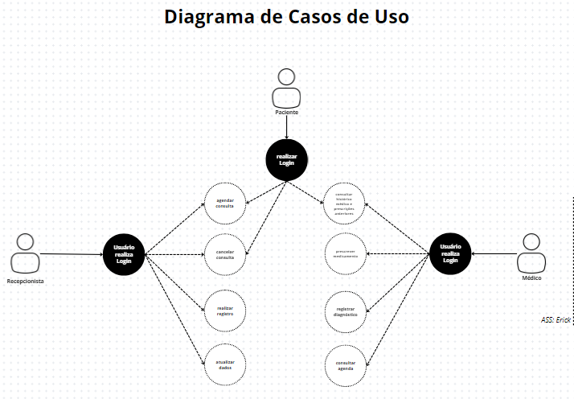
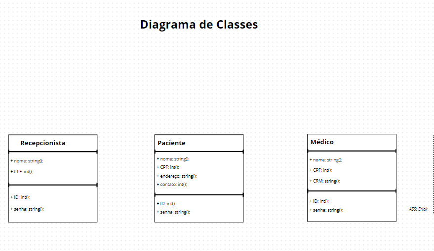
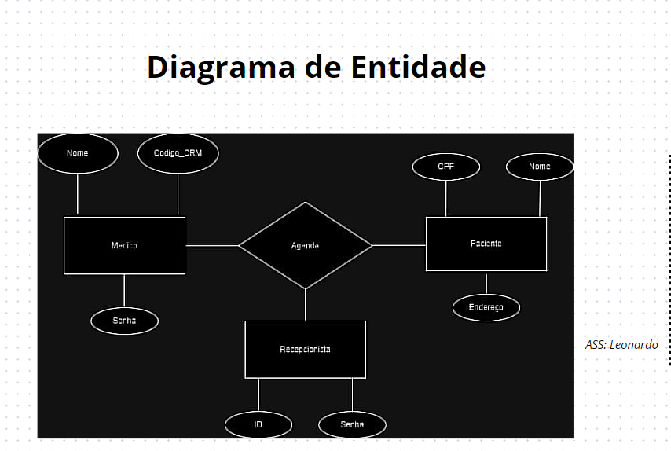

# Situação-Problema: Sistema de Gerenciamento de Clínica Médica

## Contexto

A **Clínica Saúde Total** está enfrentando desafios significativos devido ao crescimento rápido e ao uso de processos manuais para a gestão de consultas, histórico médico e informações dos pacientes. Com o aumento do número de pacientes e consultas, a clínica precisa de um sistema mais eficiente e moderno para melhorar a organização e a comunicação entre os funcionários e os pacientes.

## Problemas Identificados

1. **Agendamento de Consultas**
   - **Descrição**: O sistema atual de agendamento de consultas é manual e não integrado, o que leva a conflitos de horários e dificuldades em visualizar a disponibilidade dos médicos.
   - **Impacto**: Conflitos de agendamento, consultas duplicadas e ineficiência no gerenciamento da agenda dos médicos.

2. **Histórico Médico Fragmentado**
   - **Descrição**: Os médicos têm acesso limitado ao histórico médico dos pacientes, o que dificulta a análise completa dos casos e pode levar a diagnósticos imprecisos.
   - **Impacto**: Diagnósticos incorretos e tratamento inadequado devido à falta de informações completas.

3. **Prescrições de Medicamentos**
   - **Descrição**: A prescrição de medicamentos é realizada manualmente, sem um sistema centralizado para rastreamento, resultando em risco de erros e falta de monitoramento.
   - **Impacto**: Erros na prescrição, dificuldade em monitorar o uso de medicamentos e falta de histórico de prescrições.

4. **Atualização de Dados dos Pacientes**
   - **Descrição**: A atualização das informações dos pacientes é feita manualmente e frequentemente resulta em dados desatualizados ou incorretos.
   - **Impacto**: Informações erradas sobre pacientes, problemas na comunicação e tratamento baseado em dados desatualizados.

5. **Comunicação Ineficiente**
   - **Descrição**: A comunicação entre recepcionistas, médicos e pacientes é ineficiente, levando a falhas na gestão de consultas e na comunicação de informações importantes.
   - **Impacto**: Falhas na gestão de consultas, falta de informações importantes e insatisfação dos pacientes e funcionários.

## Requisitos do Sistema

O sistema de gerenciamento da clínica precisa resolver os seguintes problemas e atender aos seguintes requisitos:

1. **Agendamento e Cancelamento de Consultas**
   - O sistema deve permitir o agendamento e cancelamento de consultas de forma eficiente, com uma visão clara da disponibilidade dos médicos.

2. **Gerenciamento de Histórico Médico**
   - O sistema deve fornecer acesso completo ao histórico médico dos pacientes para os médicos, incluindo detalhes de consultas anteriores e prescrições.

3. **Prescrição e Monitoramento de Medicamentos**
   - O sistema deve permitir o registro e rastreamento das prescrições de medicamentos, com histórico e instruções detalhadas.

4. **Atualização de Dados dos Pacientes**
   - O sistema deve facilitar a atualização e manutenção das informações dos pacientes, garantindo que os dados estejam sempre corretos e atualizados.

5. **Comunicação e Notificações**
   - O sistema deve incluir funcionalidades para enviar notificações e lembretes sobre consultas, prescrições e outras atualizações importantes para pacientes e médicos.

---

# Atividade

Deve ser realizado através desta situação problemas os 3 diagramas estudados durante a aula: 
 - Diagrama de Caso de Uso 

 - Diagrama de Entidade 

 - Diagrama de Classe 

Vou deixar aqui para auxilio um contexto que devem existir no diagrama de caso de Uso

## Exemplos de Casos de Uso e Entidades

### Casos de Uso

### Ator: Recepcionista
 - **Agendar Consulta:** Permite ao recepcionista agendar uma consulta para um paciente.
 - **Cancelar Consulta:** Permite ao recepcionista cancelar uma consulta agendada.
 - **Registrar Paciente:** Permite ao recepcionista registrar um novo paciente no sistema.
 - **Atualizar Dados do Paciente:** Permite ao recepcionista atualizar as informações de um paciente existente.
### Ator: Médico
 - **Consultar Agenda:** Permite ao médico visualizar sua agenda de consultas.
 - **Registrar Diagnóstico:** Permite ao médico registrar o diagnóstico feito durante a consulta.
 - **Prescrever Medicamento:** Permite ao médico prescrever medicamentos para o paciente.
 - **Consultar Histórico do Paciente:** Permite ao médico acessar o histórico médico completo do paciente.
### Ator: Paciente
 - **Agendar Consulta:** Permite ao paciente agendar uma consulta.
 - **Cancelar Consulta:** Permite ao paciente cancelar uma consulta.
 - **Consultar Histórico Médico:** Permite ao paciente visualizar seu histórico médico e prescrições anteriores.

 Link do CANVAS: [DIAGRAMA DE CASOS E DIAGRAMA DE CLASSES](https://www.canva.com/design/DAGPm_mHMcc/GI_bNvurIu5Bi3aNoWVElg/edit?utm_content=DAGPm_mHMcc&utm_campaign=designshare&utm_medium=link2&utm_source=sharebutton)